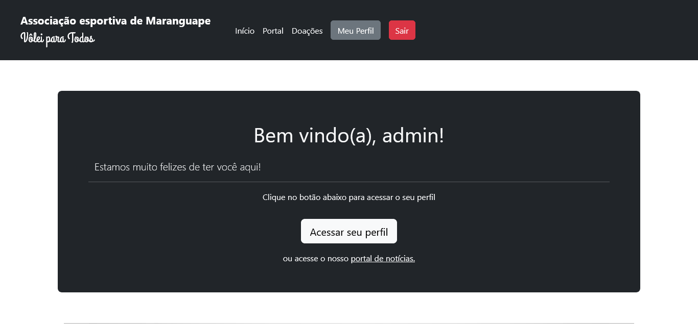

# Sistema VoleiMaranguapense

## Uma aplicação modular criada em Node.js para registro e gerenciamento de alunos e atletas jogadores de Vôleibol.

---

### Principais Tecnologias

**Back-end**
  - Mongoose
  - Node.js
    - Passport
    - Sessions
    - Flash
    - Multer
    - BCrypt
    - HBS  (Handlebars)

**Front-end**

- Bootstrap 5 
- Slicker
- HTML2Canvas
- jsPDF

### Funcionalidades principais da Aplicação

  - Cadastro e Login de usuários:
    - Recuperação de senha de acesso;
  - Criação de ficha de dados do Atleta:
    - Gerar PDF da ficha;
    - Impressão;
  - Controle administrativo de Usuários:
    - Controlar, ler e editar dados;
    - Emitir fichas;

### Atores da Aplicação

- Usuário (padrão)
- Atleta
- Administrador

## Informações adicionais

  **Esta aplicação está sobre o domínio de Kervi Jhonata e Humberto, sendo este responsável pela Associação esportiva de Maranguape, do projeto Vôlei para todos.**

  Esta aplicação possui seu código fonte aberto neste repositório, uma vez que utiliza e consome serviços open-source, no entato, sua distribuição e utilização para produção é restrita aos programadores responsáveis e gestores da associação acima citados.

## Notas do Autor
  > Em breve, estarei disponibilizando um link de acesso para a plataforma da aplicação.

  > Pretendo trazer futuras melhorias ao sistema, como uma repaginação dos layouts, com maior fluidêz para visualização mobile, visando a acesssibilidade dos usuários.
  
  > Este sistema foi criado para concretizar meus aprendizados em node.js, tendo sido o meu primeiro contato com este ambiente de execução back-end. Alguns detalhes podem não estar perfeitos para os padrões de desenvolvimento mais atuais, no entanto, dei o melhor dos meus esforços para traduzir tudo o que aprendí nesse período, sobretudo, sigo atualizando meus conhecimentos e estudos para oferecer os melhores resultados possíveis. Aprendizado constante e contínuo! ;-)
  
  > Durante a sua criação, estive de encontro com diversos desafios que me impulsionaram a progredir como desenvolvedor. Pude aperfeiçoar e desenvolver novas técnicas e Soft Skills, buscando e integrando soluções autônomas para as mais diversas necessidades.

---

### conteúdo relacionado: 
  ``{
    "relatedContents": {
      "tags": "'javascript', 'js', 'node', 'nodejs', 'frontend', 'backend'"
    }
  }``
